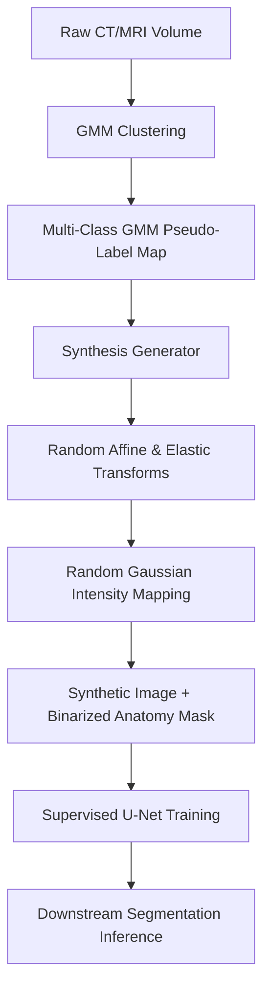

# Segmentaion-via-GMM
### Abstract
We present an automated pipeline for medical image segmentation that utilizes unsupervised pseudo-labels to train a supervised deep learning model (U-Net). We investigate this approach across two distinct clinical tasks: brain MRI skull-stripping on the SynthStrip 2D dataset, and zero-shot cross-modality liver segmentation on the CHAOS dataset. Our pipeline employs a Gaussian Mixture Model (GMM) to partition tissues and generate multi-class pseudo-labels, which then feed a synthesis-based training framework to learn robust structural representations without expert annotations.  

We systematically evaluate the impact of GMM component granularity (ranging from 3 to 16 components), label-mapping alignment, and training duration on downstream segmentation accuracy. Our quantitative evaluation using the Dice coefficient reveals that:
1.	Brain MRI Skull-Stripping: Models trained on FSM pseudo-labels achieved a peak Dice coefficient of 0.9168 with 3 components, outperforming the expert ground-truth baseline of 0.8650, while over-segmentation led to severe degradation.
2.	Cross-Modality Liver Segmentation (CT-to-MRI): Under zero-shot transfer (trained on CT, tested on MRI), a 5-component (5c) GMM configuration trained for 50 epochs achieved a peak Dice coefficient of 0.4774 (and peak patient Dice of 0.6381), outperforming its 20-epoch counterpart (0.2152) by over 2.2x. Furthermore, we demonstrate that incorrect cluster-to-anatomy mapping results in complete training failure, emphasizing the sensitivity of synthetic label-to-image generators to semantic alignment.

### Introduction
Automated segmentation of anatomical structures—such as brain extraction (skull-stripping) or abdominal organ segmentation—remains a core prerequisite in neuroimaging and computer-assisted surgery pipelines. Supervised deep convolutional neural networks (CNNs), particularly U-Net architectures, represent state-of-the-art in segmentation accuracy. However, their clinical utility is bottlenecked by their reliance on extensive, high-quality, manually annotated datasets. Manual annotations are labor-intensive, suffer from inter-expert variability, and fail to scale across diverse scanners, field strengths, and acquisition modalities.  

To circumvent these issues, we investigate a synthesis-based training framework powered by unsupervised GMM pseudo-labels. Instead of training on real images with expert labels, we train a U-Net on synthetic images generated on-the-fly from multi-class tissue label maps. The label maps are generated automatically using Gaussian Mixture Models (GMM) to cluster voxel intensities.  

We explore this framework in two case studies:  
- Case Study I: Brain MRI Skull-Stripping (SynthStrip 2D): Within-modality extraction where models are trained on synthetic brain label maps and evaluated on unseen brain MRI test cases.  
- Case Study II: Abdominal Liver Segmentation (CHAOS CT/MRI): Zero-shot cross-modality domain transfer where models are trained on synthetic labels derived from CT scans and evaluated directly on unseen MRI scans.
Our study validates the impact of GMM clustering granularity, label-to-anatomy mappings, and training epochs on downstream segmentation accuracy.

  
### Methodology

